## Table of Contents

- [Project Overview](#project-overview)
- [Features](#features)
- [AWS Services Used](#aws-services-used)
- [Project Architecture](#project-architecture)
- [Project Workflow](#project-workflow)
- [Project Structure](#project-structure)
- [Technologies Used](#technologies-used)
- [Security Features](#security-features)
- [High Availability](#high-availability)
- [Application Screenshots](#application-screenshots)
- [AWS Infrastructure](#aws-infrastructure)
- [Deployment Guide](#deployment-guide)
- [Skills Demonstrated](#skills-demonstrated)
- [Future Improvements](#future-improvements)
- [Author](#author)


# AWS Employee Management System

A cloud-based Employee Management System deployed on **Amazon Web Services (AWS)** using a highly available and scalable architecture. The application is built with **PHP** and **MySQL**, hosted on **Amazon EC2**, connected to **Amazon RDS**, secured with **AWS Secrets Manager**, monitored using **Amazon CloudWatch**, and deployed behind an **Application Load Balancer (ALB)** with **Auto Scaling**.

---

## Project Overview

This project demonstrates how to deploy a traditional PHP web application using AWS cloud services while following cloud best practices such as high availability, centralized monitoring, secure credential management, and automatic scaling.

The project showcases an end-to-end AWS deployment suitable for learning cloud infrastructure and demonstrating practical AWS skills.

---
## Features

- Secure user authentication
- Employee management dashboard
- Add, edit, view, and delete employee records
- Amazon RDS MySQL database
- Secure database credentials using AWS Secrets Manager
- Application Load Balancer (ALB)
- Auto Scaling Group (ASG)
- Amazon CloudWatch monitoring
- SNS email notifications
- IAM role-based authentication
- Highly available cloud architecture

## AWS Services Used

| AWS Service | Purpose |

| Amazon EC2 | Hosts the PHP Employee Management application |
| Amazon RDS | Stores employee data in MySQL |
| Amazon VPC | Provides isolated networking |
| Security Groups | Controls inbound and outbound traffic |
| Internet Gateway | Enables internet access |
| Application Load Balancer | Distributes incoming traffic |
| Auto Scaling Group | Automatically replaces unhealthy instances |
| Amazon CloudWatch | Collects logs and performance metrics |
| Amazon SNS | Sends email notifications |
| AWS Secrets Manager | Securely stores database credentials |
| IAM | Provides secure permissions to AWS services |


## Project Architecture

The application follows a highly available AWS architecture.

```
                    Internet
                        │
                        ▼
        Application Load Balancer
                        │
                        ▼
            Auto Scaling Group
                        │
                        ▼
             EC2 (Apache + PHP)
                        │
        ┌───────────────┼────────────────┐
        │               │                │
        ▼               ▼                ▼
 Amazon RDS      Secrets Manager   CloudWatch
                                         │
                                         ▼
                                   Amazon SNS

```

## Project Workflow

1. User accesses the application using the Application Load Balancer (ALB) DNS.
2. The ALB forwards incoming HTTP requests to healthy EC2 instances.
3. The Employee Management application runs on Apache Web Server using PHP.
4. Database credentials are securely retrieved from AWS Secrets Manager.
5. The application connects to Amazon RDS MySQL to perform CRUD operations.
6. Amazon CloudWatch collects application logs and infrastructure metrics.
7. Amazon SNS sends email notifications for Auto Scaling events.
8. Auto Scaling Group automatically replaces unhealthy instances and maintains application availability.


## Project Structure

```
employee-management/
│
├── assets/
│   ├── css/
│   └── images/
│
├── config/
│   └── db.php
│
├── helpers/
├── includes/
├── sql/
├── uploads/
├── vendor/
│
├── add_employee.php
├── authenticate.php
├── dashboard.php
├── delete_employee.php
├── edit_employee.php
├── index.php
├── login.php
├── logout.php
├── search.php
├── view_employee.php
│
├── composer.json
├── composer.lock
└── README.md
```

## Technologies Used

### Programming Languages
- PHP
- SQL
- HTML
- CSS
- JavaScript

### Database
- MySQL (Amazon RDS)

### Web Server
- Apache2

### Cloud Services
- Amazon EC2
- Amazon RDS
- Amazon VPC
- Application Load Balancer
- Auto Scaling Group
- AWS Secrets Manager
- Amazon CloudWatch
- Amazon SNS
- IAM

### Operating System
- Ubuntu 24.04 LTS

### Tools
- Git
- GitHub
- Composer
- AWS Management Console


## Security Features

- IAM Role attached to EC2 instance for secure AWS service access.
- Database credentials stored securely in AWS Secrets Manager.
- No database passwords stored in the application source code.
- Security Groups configured to allow only required traffic.
- RDS database is accessible only from the EC2 Security Group.
- Application Load Balancer handles incoming HTTP traffic.
- CloudWatch monitoring provides operational visibility.


## High Availability

This project is designed with high availability in mind.

- Application Load Balancer distributes incoming requests.
- Auto Scaling Group automatically launches replacement instances if an EC2 instance becomes unhealthy.
- CloudWatch monitors infrastructure metrics.
- SNS sends notifications for Auto Scaling events.
- Amazon RDS provides a managed relational database service for persistent storage.


## Application Screenshots

### Login Page


---

### Dashboard

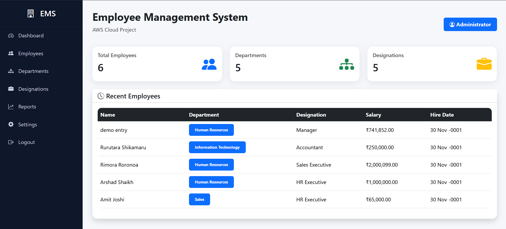

---

### Employee List

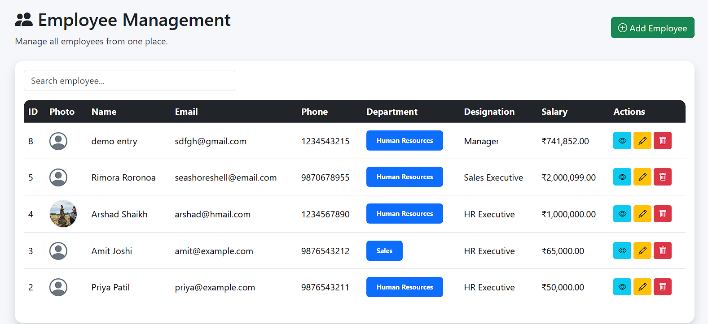

---

### Add Employee

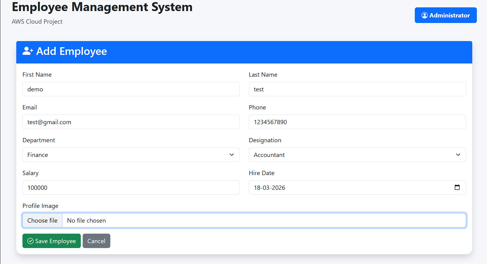

---

### Edit Employee

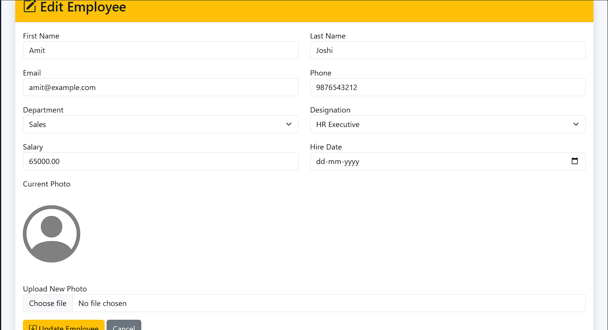

## AWS Infrastructure

### Amazon VPC

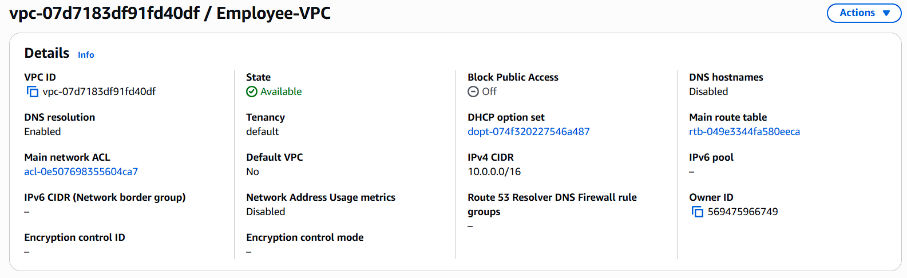

---

### Amazon EC2

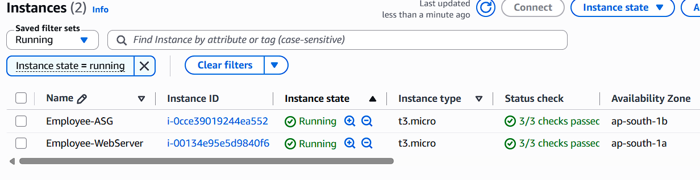

---

### Amazon RDS

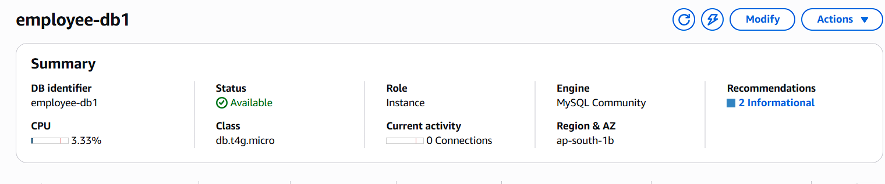

---

### Application Load Balancer

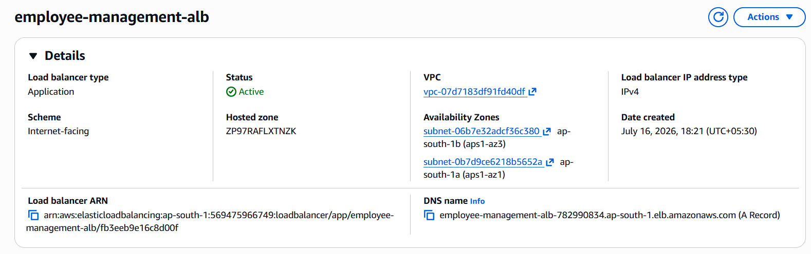

---

### Target Group

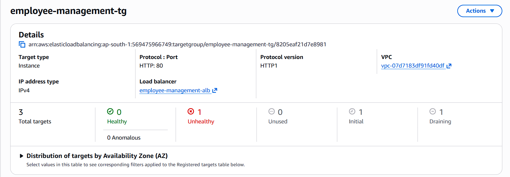

---

### Auto Scaling Group

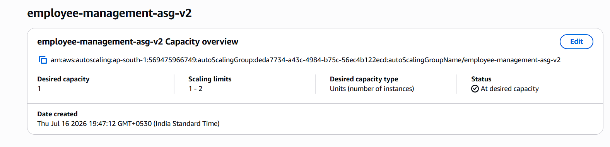

---

### CloudWatch Monitoring

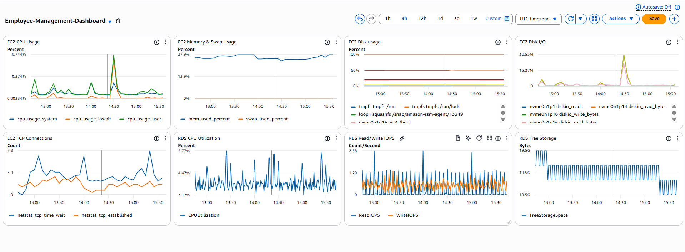

---

### SNS Notifications

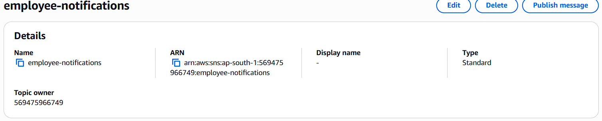

---

### AWS Secrets Manager

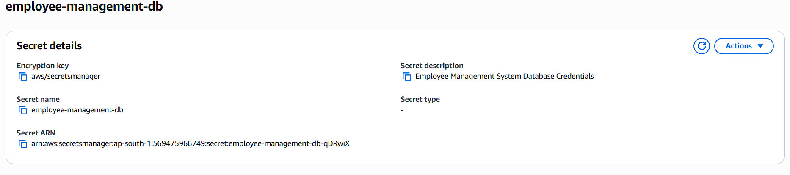

## Deployment Guide

### Prerequisites

- AWS Account
- Amazon EC2
- Amazon RDS MySQL
- IAM Role
- AWS Secrets Manager
- CloudWatch Agent
- Application Load Balancer
- Auto Scaling Group
- Git
- Composer
- Apache2
- PHP 8.3

### Deployment Steps

1. Launch an EC2 instance with Ubuntu.
2. Install Apache, PHP, Composer, and Git.
3. Clone the project repository.
4. Configure the application.
5. Create an Amazon RDS MySQL database.
6. Store database credentials in AWS Secrets Manager.
7. Attach an IAM Role to the EC2 instance.
8. Configure the CloudWatch Agent.
9. Create an Application Load Balancer.
10. Create a Target Group.
11. Create an AMI.
12. Create a Launch Template.
13. Configure an Auto Scaling Group.
14. Verify application availability using the ALB DNS.

## Skills Demonstrated

- Amazon EC2 Management
- Amazon RDS Administration
- Virtual Private Cloud (VPC)
- Security Groups
- IAM Roles and Policies
- AWS Secrets Manager
- CloudWatch Metrics and Logs
- Amazon SNS Notifications
- Application Load Balancer
- Auto Scaling
- Apache Web Server Administration
- PHP Application Deployment
- MySQL Database Management
- Linux Server Administration
- Git & GitHub Version Control

## Future Improvements

- Enable HTTPS using AWS Certificate Manager (ACM)
- Configure Route 53 with a custom domain
- Implement CI/CD using AWS CodePipeline
- Automate infrastructure provisioning with Terraform
- Enhance monitoring with CloudWatch Dashboards and Alarms


## Author

**Arshad Mubarak Shaikh**

- GitHub: https://github.com/ArshadShaikh107
- LinkedIn: www.linkedin.com/in/arshadshaikh107

